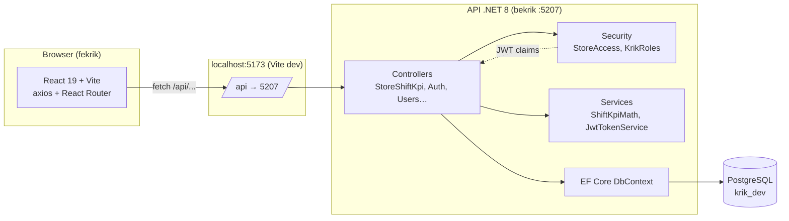
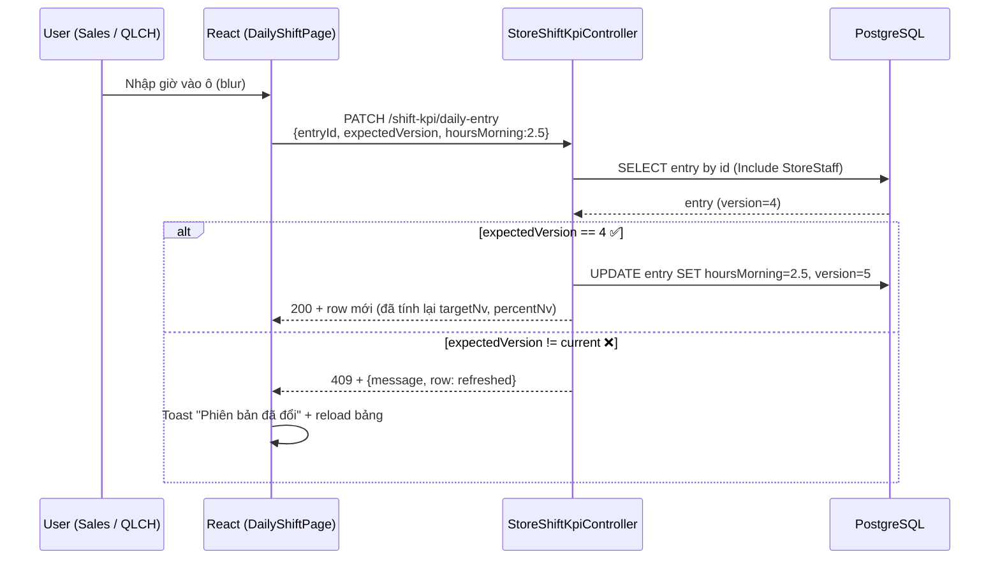
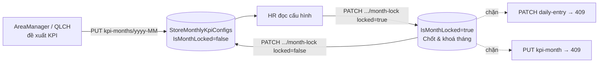

# Krik — Module Công & KPI nhân viên cửa hàng

Hệ thống quản lý **bảng công ngày**, **cấu hình KPI tháng**, **dashboard tháng**, **bảng lương** cho chuỗi cửa hàng bán lẻ.
Repo `bekrik` chứa **API (.NET 8 + PostgreSQL)**, repo song hành `../fekrik` chứa **giao diện (React + Vite)**.

> Bài take-home phỏng vấn Full-Stack. README này dùng cho cả người demo (interviewer) và developer đọc lại sau này — nên giải thích cặn kẽ từng thành phần và lý do chọn.

---

## 1. Tech stack & lý do chọn

| Lớp | Công nghệ | Lý do |
| --- | --- | --- |
| API runtime | **.NET 8 (ASP.NET Core)** | Hệ sinh thái EF Core thuần, type-safe, hiệu năng tốt cho bài MVP; hỗ trợ JWT, Swagger, controller-based routing rõ ràng |
| ORM | **EF Core 8 + Npgsql** | Migration / scaffold nhanh, LINQ → SQL native, đủ cho domain nhiều quan hệ 1‑n và unique index ghép |
| DB | **PostgreSQL** | Free, mạnh về kiểu `DateOnly`, JSON cột, transaction; phù hợp production. *(Trade-off so với InMemory: xem mục 7.)* |
| Auth | **JWT Bearer + BCrypt** | Stateless, dễ thêm role/area claim; BCrypt vì hash password chuẩn, có cost factor |
| Logic công thức | **Class thuần `ShiftKpiMath`** | Không phụ thuộc DB → unit test thẳng bằng `xUnit`, chạy nhanh |
| Excel export | **ClosedXML 0.102** | API thân thiện, không cần Excel cài máy; đủ cho payroll 19 cột |
| FE | **React 19 + Vite 8 + TypeScript** | Vite HMR cực nhanh, type-safe contract giữa DTO BE ↔ FE; React Router 7 cho route nested |
| FE → API | **axios + Vite proxy** | proxy `/api` né CORS lúc dev; production đổi `VITE_API_BASE` đơn giản |
| Test BE | **xUnit** | Chuẩn .NET; project test riêng `Krik.Api.Tests` |
| Lint FE | **typescript-eslint + react-hooks** | Bắt sớm lỗi rules of hooks và type narrowing |

---

## 2. Kiến trúc tổng thể



**Phân lớp BE:**

```
src/Krik.Api/
├─ Controllers/            # HTTP entry — phân quyền + validate + EF query
│  ├─ AuthController.cs            # POST /api/auth/login, GET /api/auth/me
│  ├─ StoresController.cs          # CRUD stores + export Excel
│  ├─ AreasController.cs           # GET /api/areas
│  ├─ UsersController.cs           # GET /api/users (AdminHR)
│  ├─ AdminController.cs           # /api/admin/ping
│  └─ StoreShiftKpiController.cs   # toàn bộ module Công & KPI
├─ Contracts/              # Record DTO (request / response)
├─ Entities/               # POCO map sang bảng
├─ Data/                   # DbContext, DbInitializer, StaffShiftKpiDemoSeed
│  └─ Migrations/          # EF migrations (4 file)
├─ Security/               # StoreAccess (gate truy cập), KrikRoles
├─ Services/               # ShiftKpiMath, JwtTokenService
├─ Options/                # JwtOptions
└─ Program.cs              # bootstrap: DbContext, JWT, CORS, Swagger, Migrate+Seed
```

**Phân lớp FE:**

```
fekrik/src/
├─ api/                    # axios client + tất cả call API (krikApi.ts)
├─ auth/                   # AuthContext (token + user + login/logout)
├─ routes/                 # RequireAuth, RequireRole guard
├─ layout/                 # AppLayout (sidebar, header)
├─ pages/                  # StoresPage, LoginPage, AdminPage
│  └─ shiftKpi/            # DailyShiftPage, MonthlyShiftPage (dashboard),
│                          #   KpiConfigPage, StaffListPage, PayrollPage
├─ components/             # MoneyCellInput, …
├─ hooks/                  # useShiftKpiStoreId
├─ utils/                  # formatMoneyEn, parseMoneyEn
├─ types/                  # Type-mirror DTO BE (api.ts, shiftKpi.ts)
└─ theme/                  # CSS chung
```

Chi tiết domain & công thức: [`docs/design.md`](docs/design.md).

---

## 3. Setup & run local (≤ 2 lệnh)

### 3.1 Yêu cầu máy

- **.NET SDK 8** (`dotnet --version` ≥ 8)
- **Node.js 20+** (`node -v`)
- **PostgreSQL 13+** chạy local (mặc định `localhost:5432`)

### 3.2 Chuẩn bị DB

```sql
-- chạy bằng psql / pgAdmin
CREATE DATABASE krik_dev;
```

Sửa connection string ở `bekrik/src/Krik.Api/appsettings.json` → `ConnectionStrings:DefaultConnection`:

```jsonc
"DefaultConnection": "Host=localhost;Port=5432;Database=krik_dev;Username=postgres;Password=YOUR_PASSWORD"
```

### 3.3 Chạy cả API + FE bằng 1 lệnh

Trong thư mục `bekrik`:

```powershell
.\start-dev.ps1
```

Script `start-dev.ps1` sẽ:
1. Tự `npm install` cho `../fekrik` nếu chưa có `node_modules`.
2. Spawn 2 PowerShell job: `dotnet run --project src/Krik.Api` (API :5207) và `npm run dev` trong fekrik (FE :5173).
3. Stream log của 2 job vào cùng cửa sổ (prefix `[api]` / `[fe ]`).
4. `Ctrl+C` để dừng cả 2.

### 3.4 Hoặc 2 lệnh (mỗi terminal 1 lệnh)

```powershell
# Terminal 1 — API
cd bekrik
dotnet tool restore
dotnet run --project src/Krik.Api
# Swagger:   http://localhost:5207/swagger
```

```powershell
# Terminal 2 — FE
cd fekrik
npm install
npm run dev
# Web:       http://localhost:5173
```

> Lần đầu API chạy sẽ `Migrate()` + seed: 1 area BNB, 2 cửa hàng K01/K02, 4 user, module Công & KPI cho K01 (8 NV, KPI tháng 2026‑05, ~1 tuần `StaffDailyEntry`).

### 3.5 Tài khoản seed (mật khẩu: `Admin123!`)

| Email | Role | Phạm vi |
| --- | --- | --- |
| `admin@krik.local` | AdminHR | Toàn chuỗi — quản trị, accept & khoá tháng KPI |
| `area@krik.local` | AreaManager | Cửa hàng thuộc khu BNB — đề xuất KPI tháng cho cả khu |
| `store@krik.local` | StoreManager | Chỉ K01 — đề xuất KPI tháng **ngày mùng 1**, sửa bảng công cả store |
| `sales@krik.local` | SalesStaff | Chỉ K01, chỉ row gắn `LinkedUserId` của mình |

Chi tiết kịch bản thử nghiệm: [`HUONG_DAN_TEST.md`](HUONG_DAN_TEST.md).

---

## 4. Database migration & seed

### 4.1 Migration

`dotnet-ef` được pin trong `.config/dotnet-tools.json`. Lệnh cơ bản:

```powershell
# Thêm migration mới
dotnet tool run dotnet-ef migrations add TenMigration `
    --project src/Krik.Api --output-dir Data/Migrations

# Áp dụng migration thủ công (mặc định API tự `Migrate()` khi start)
dotnet tool run dotnet-ef database update --project src/Krik.Api

# Revert về migration trước
dotnet tool run dotnet-ef database update PreviousMigrationName --project src/Krik.Api
```

Các migration hiện có (theo thứ tự thời gian):

1. `InitialCreate` — Roles / Users / Areas / Stores / UserRole / UserArea.
2. `StaffShiftKpiModule` — `StoreStaff`, `StaffDailyEntry`, `StoreDailySummary`, `StoreMonthlyKpiConfig`, `CommissionBracket`.
3. `RenameMockApiToTongDoanhThuHeThong` — đổi tên cột "DT đối chiếu kênh".
4. `StoreDailySummaryIsDayLocked` — thêm cờ khoá ngày.

### 4.2 Seed

`Program.cs` gọi `DbInitializer.SeedAsync` mỗi lần start. Hai tầng:

- **`DbInitializer`** — seed user/role/area/store (nếu chưa có Role).
- **`StaffShiftKpiDemoSeed`** — seed module Công & KPI cho K01 (chạy 1 lần — guard `db.StoreStaff.AnyAsync(s => s.StoreId == K01)`).

Để reset toàn bộ dữ liệu: drop DB rồi tạo lại — `Migrate()` + seed sẽ tự chạy.

---

## 5. Cách chạy test

```powershell
cd bekrik
dotnet test tests/Krik.Api.Tests
```

Hiện có **8 unit test** trong `ShiftKpiMathTests.cs` cho công thức 5.1 → 5.4 và phụ trợ:

| Test | Đề bài |
| --- | --- |
| `DailyPersonalTargets_zeroSum_weights_match_spec_5_1` | Mục tiêu DT cá nhân chia theo trọng số giờ NVBH |
| `RebalancedDayTarget_matches_spec_5_2` | Rebalance KPI ngày khi tuần đã chạy lệch |
| `PickCommissionPct_ft_tiers_from_spec_5_3` | Bậc commission theo % KPI cửa hàng |
| `MonthlySalary_matches_spec_5_4` | Lương = giờ × rate + commission + team bonus QLCH |
| `DailyTargetFromMonthConfig_*` | Suy KPI ngày từ KPI tháng + JSON ngày trong tuần |
| `WeekSliceIndexInMonth_*`, `TryWeeklyRebalancedStoreDayKpi_*` | Helper rebalance tuần |

> Test không cần DB — `ShiftKpiMath` là class thuần (static methods). Controller integration test chưa làm, ghi nhận ở mục Trade-offs.

**Build / lỗi DLL bị khoá:** nếu `dotnet build` báo `MSB3021` / `MSB3027` thì có 1 tiến trình API đang chạy chiếm `bin\Debug\net8.0\Krik.Api.dll`. Dừng tiến trình hoặc build ra dir khác:

```powershell
dotnet build src/Krik.Api/Krik.Api.csproj -o _build_out
```

---

## 6. Luồng dữ liệu chính

### 6.1 Bảng công ngày — save-on-blur + version



### 6.2 KPI tháng — workflow Accept



- **QLCH** chỉ sửa được khi `DateTime.Now.Day == 1` và trùng tháng đang cấu hình (`StoreAccess.CanEditKpiMonthConfig`).
- **AdminHR** không trực tiếp PUT cấu hình; HR chỉ accept (khoá) hoặc mở khoá lại.

---

## 7. Trade-offs & những gì bỏ qua

| Quyết định | Lý do | Đánh đổi |
| --- | --- | --- |
| **PostgreSQL thật cho dev, không SQLite/InMemory** | Sát môi trường production; test `DateOnly` và unique index ghép chuẩn | Cần cài Postgres local; test integration phải dựng DB ngoài (chưa làm) |
| **Công thức KPI tách `ShiftKpiMath` thuần** | Test nhanh không cần dựng DB; tái dùng cho export Excel | Cần truyền nhiều tham số vào method — chấp nhận để tránh phụ thuộc EF |
| **Tỷ trọng tuần / ngày / ca lưu JSON cột** (`WeekRatiosJson`…) | Schema gọn, tránh đẻ nhiều bảng nhỏ; đề bài cho cấu trúc cố định 5 tuần / 7 ngày / weekday-weekend | Phải parse JSON khi tính → có fallback (chia đều tháng) nếu JSON sai |
| **Save-on-blur + optimistic version (không lock pessimistic)** | Đa người dùng cửa hàng ít va chạm; UX tốt hơn modal khoá | Race khi 2 user sửa 1 ô — trả 409 và để FE reload (đã implement) |
| **HR chỉ accept/khoá, không trực tiếp PUT KPI tháng** | Khớp HR workflow thực tế: HR review, manager đề xuất | Bạn cần đổi role để test cả 2 hướng — đã có 3 tài khoản seed |
| **QLCH chỉ sửa KPI ngày mùng 1** | Đề bài muốn finalize KPI đầu kỳ; tránh QLCH chỉnh trong tháng | Test thủ công cần đổi giờ Windows tới `01/MM/yyyy` |
| **Excel payroll 19 cột chỉ trong file export, UI rút gọn ~10 cột** | Người dùng xem nhanh trên UI; xuất Excel cho HR phân tích | UI không khớp 100% spec đề; chấp nhận |
| **Integration test chưa làm (chỉ unit `ShiftKpiMath`)** | Thời lượng take-home + ưu tiên FE đầy đủ 5 trang | Để TODO; thiết kế đã sẵn — `WebApplicationFactory` + Postgres Testcontainers |
| **2 repo (bekrik, fekrik) thay vì monorepo / docker-compose** | Phản chiếu workflow thực tế nhiều team; tránh dependency tooling chéo | Cần 2 lệnh (đã gói trong `start-dev.ps1` thành 1) |
| **Stretch trang (`calendar`, `my-profile`, `settings`)** | Ngoài 5 trang MVP đề bắt buộc | Bỏ — ghi nhận trong `docs/PHAN_TICH_DEV_TEST.md` |
| **Hệ thống realtime / audit log / dark mode / i18n** | Điểm cộng, không bắt buộc | Bỏ — phạm vi take-home |

---

## 8. Demo

- **Repo**: 2 thư mục song hành `bekrik` + `fekrik`. README này là chỉ dẫn chính.
- **Video demo** (≤ 5 phút): _TODO_ — đường dẫn sẽ điền sau khi quay.
  - Gợi ý kịch bản quay: đăng nhập 4 role → bảng công + save-on-blur 409 → cấu hình KPI workflow đề xuất + accept → dashboard tháng (progress bar + chart + top NV) → xuất Excel payroll.
- **Deploy URL**: _TODO_ — nếu cần deploy có thể dùng Render/Railway cho .NET + Vercel/Netlify cho FE.

---

## 9. Mục lục tài liệu

- [`docs/design.md`](docs/design.md) — ERD, permission model, save-on-blur, trade-offs (bản đặc tả thiết kế).
- [`docs/PHAN_TICH_DEV_TEST.md`](docs/PHAN_TICH_DEV_TEST.md) — bảng đối chiếu yêu cầu đề ↔ trạng thái triển khai.
- [`HUONG_DAN_TEST.md`](HUONG_DAN_TEST.md) — tài khoản seed, dữ liệu seed, kịch bản thử nghiệm tay.
- Swagger live: `http://localhost:5207/swagger` (sau khi chạy API).
