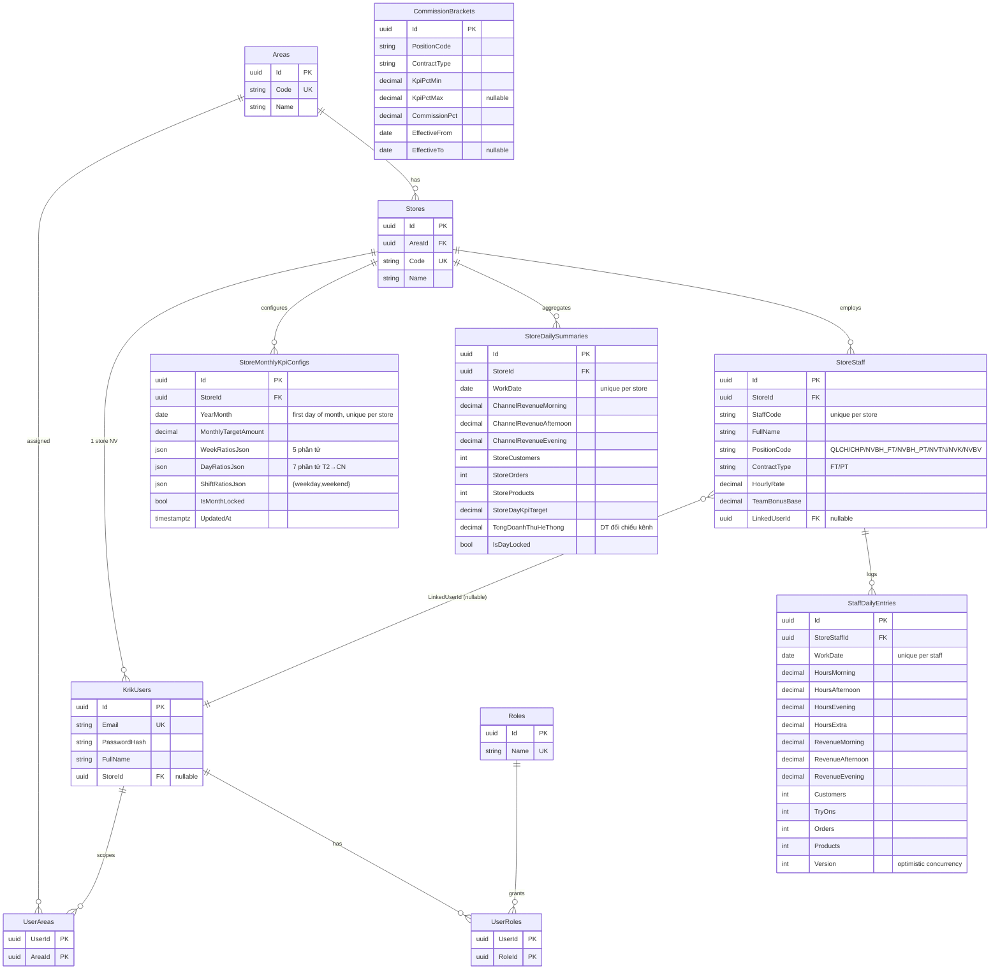
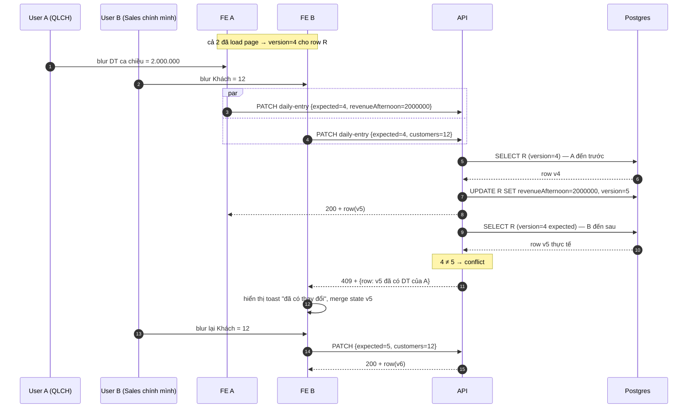

# Thiết kế — Module Công & KPI nhân viên cửa hàng

Tài liệu kỹ thuật ngắn (~3 trang) cho bài take-home: 5 trang MVP (Bảng công ngày · Tổng quan tháng · Cấu hình KPI · Danh sách NV · Bảng lương) + REST API + RBAC + công thức KPI/lương + save-on-blur.

> Nguồn nghiệp vụ tham chiếu: Excel/Google Sheet tab **1.Nhập DL** — tổng kênh theo ca → từng NV (giờ, DT, chỉ số phụ). Hệ thống chuẩn hoá để đa cửa hàng & nhiều khu vực.

---

## 1. ERD

### 1.1 Sơ đồ quan hệ (Mermaid)

### 1.2 Liệt kê bảng & ý nghĩa

| Bảng | Mục đích | Khoá / Index quan trọng |
| --- | --- | --- |
| `Areas`, `Stores` | Cấu trúc tổ chức 2 cấp khu vực → cửa hàng | `Code` unique |
| `Roles`, `KrikUsers`, `UserRoles`, `UserAreas` | RBAC + scope khu vực; `KrikUsers.StoreId` định danh cửa hàng cho QLCH/Sales | `Email` unique, `UserRoles(PK ghép)` |
| `StoreStaff` | Hồ sơ NV cửa hàng. `LinkedUserId` nối tới tài khoản đăng nhập (nullable cho NV không có login) | `(StoreId, StaffCode)` unique |
| `StaffDailyEntries` | Bảng công ngày: giờ 4 cột + DT 3 ca + chỉ số phụ + **Version** cho optimistic concurrency | `(StoreStaffId, WorkDate)` unique |
| `StoreDailySummaries` | Bảng tổng cửa hàng theo ngày: doanh thu kênh, KPI ngày, **IsDayLocked** | `(StoreId, WorkDate)` unique |
| `StoreMonthlyKpiConfigs` | Cấu hình KPI tháng: target + JSON tỷ trọng tuần/ngày/ca + **IsMonthLocked** | `(StoreId, YearMonth)` unique |
| `CommissionBrackets` | Bậc hoa hồng theo (Position, Contract) có hiệu lực theo thời gian | Index `(PositionCode, ContractType, EffectiveFrom)` |

**Lý do mô hình:**

- `StaffDailyEntries.Version`: yêu cầu đề bài về save-on-blur — race chỉ xảy ra ở dòng NV/ngày → đặt Version đúng granularity nhỏ nhất.
- `StoreDailySummaries.IsDayLocked` thay vì bảng `StoreDayLocks` riêng: 1‑1 với `(StoreId, WorkDate)` nên gộp cột tiết kiệm join.
- `WeekRatiosJson` / `DayRatiosJson` / `ShiftRatiosJson` lưu chuỗi JSON thay vì 3 bảng con: dữ liệu cấu hình, đọc nhiều ghi ít, schema cố định (5/7/{weekday,weekend}) → JSON cột là trade-off đáng giá.
- `LinkedUserId` nullable + `OnDelete(SetNull)`: cho phép tạo NV chưa cấp tài khoản; xoá user không gãy bảng công.

---

## 2. Permission model

### 2.1 Role & claim JWT

| Role | Phạm vi mặc định | Claim |
| --- | --- | --- |
| `AdminHR` | Toàn chuỗi | `role=AdminHR`, không `store_id`, không `area_id` |
| `AreaManager` | Khu vực được gán | `role=AreaManager`, `area_id` (lặp theo từng khu) |
| `StoreManager` (QLCH) | Một cửa hàng | `role=StoreManager`, `store_id` |
| `SalesStaff` | Một cửa hàng, chỉ NV gắn user | `role=SalesStaff`, `store_id` |

Claim được sinh ở `Services/JwtTokenService.cs`; verify ở `Program.cs` (JwtBearer + `RoleClaimType=ClaimTypes.Role`).

### 2.2 Ma trận hành động (key flow)

| Hành động | Admin HR | Area | Store (QLCH) | Sales |
| --- | --- | --- | --- | --- |
| `CanAccessStore` (gate gốc) | mọi store | store thuộc area | `Users.StoreId == storeId` | `Users.StoreId == storeId` |
| `GET /shift-kpi/daily` | ✔ toàn bảng | ✔ toàn bảng | ✔ toàn bảng | ✔ **chỉ row có `LinkedUserId == userId`** |
| `PATCH /shift-kpi/daily-entry` | ✔ | ✔ | ✔ (trừ QLCH/CHP đồng cấp) | ✔ chỉ row của mình |
| `PATCH /shift-kpi/daily-entry` ngày quá khứ (`WorkDate < today`) | ✔ | ✔ | ✔ | ✘ 403 |
| `PUT /shift-kpi/kpi-months/{ym}` | ✘ | ✔ | ✔ **chỉ khi `Today` = ngày 1 của `ym`** | ✘ |
| `PATCH /shift-kpi/kpi-months/{ym}/month-lock` | ✔ | ✘ | ✘ | ✘ |
| `PATCH /shift-kpi/daily-day-lock` | ✔ | ✘ | ✘ | ✘ |
| `POST /shift-kpi/daily-equalize` | ✔ | ✔ | ✔ | ✘ |
| `CRUD staff master` (`/shift-kpi/staff*`) | ✔ | ✔ | ✔ | ✘ |
| `PATCH /shift-kpi/staff/{id}/position` (inline change) | ✔ | ✔ | ✔ | ✘ |
| `IsMonthLocked` / `IsDayLocked` | bypass duy nhất qua mở khoá (HR) | chặn cứng | chặn cứng | chặn cứng |

Implementation ở `Security/StoreAccess.cs`:

- `CanAccessStoreAsync(...)` — gate vào store theo role & claim.
- `CanEditKpiMonthConfig(user, yearMonth, serverToday)` — AreaManager luôn được; StoreManager chỉ khi `serverToday.Day == 1 && cùng tháng`.
- `CanAcceptKpiMonth(user)` — chỉ AdminHR.
- `CanEditStaffMaster`, `CanEditPastShiftDailyWorkDate`, …

Edge case **QLCH đồng cấp**: trong cùng 1 cửa hàng có nhiều người chức danh `QLCH` / `CHP`, StoreManager không PATCH được dòng của QLCH/CHP khác — implement ở `CanUserPatchDailyRowAsync` trong `StoreShiftKpiController`. Mục đích: tránh người này sửa giờ/DT của người ngang quyền.

### 2.3 HR workflow KPI tháng (Accept-Lock)

```mermaid
stateDiagram-v2
    [*] --> Open: tạo cấu hình (mặc định IsMonthLocked=false)
    Open --> Open: PUT KPI tháng<br/>(Area: bất kỳ; QLCH: ngày 1)
    Open --> Locked: HR bấm "Chốt & khoá tháng"<br/>PATCH month-lock locked=true
    Locked --> Open: HR bấm "Mở khoá tháng"<br/>PATCH month-lock locked=false
    Locked --> [*]: Tháng kết thúc
    note right of Locked
      Khi Locked:
      - PUT KPI tháng → 409
      - PATCH daily-entry → 409
      - Không sửa được cấu hình & bảng công
    end note
```

---

## 3. Save-on-blur + race condition

### 3.1 Cơ chế

Mỗi `StaffDailyEntries` có cột `Version` (int). Mỗi PATCH gửi kèm `expectedVersion`.

- Khớp ⇒ cập nhật field, `Version++`, trả `200` + DTO mới (đã tính lại `targetNv`, `percentNv` từ KPI ngày).
- Lệch ⇒ `409 Conflict` + payload `{ message, row }` (`row` đã tính lại). FE dùng `row` để refresh ô + thông báo.

### 3.2 Sequence khi 2 user cùng sửa 1 ô

### 3.3 Vì sao optimistic mà không pessimistic lock?

- Cửa hàng MVP đa số 1 user/ô → race rất hiếm. Pessimistic lock yêu cầu modal "đang sửa" hay timeout cleanup phức tạp → UX nặng.
- Version cột `int` tự cộng đủ nhanh, không phụ thuộc DB feature (chạy được PostgreSQL/SQL Server/SQLite nếu sau này đổi).
- Khi conflict, FE đã có sẵn `row` mới → cập nhật 1 ô không cần `GET /daily` lại.

### 3.4 Lock layer phụ

- **`IsMonthLocked`** (cấu hình KPI tháng) và **`IsDayLocked`** (`StoreDailySummaries`): chặn PATCH ở tầng cao hơn version. Trả `409` với message rõ ràng ("Tháng đã khoá", "Ngày đã khoá").
- HR mở khoá → toggle cờ, không cần đụng `Version` của entries.

---

## 4. Công thức (mục 5 đề bài) — tóm tắt

Tách trong `Services/ShiftKpiMath.cs` (static, pure). Mỗi công thức 1 unit test trong `tests/Krik.Api.Tests`.

| ID | Công thức | API method |
| --- | --- | --- |
| 5.1 | Mục tiêu DT NV ngày = `KPI_ngày_cửa_hàng × weightNv / totalWeight`. `weightNv = sum(giờ 4 cột)` cho **NVBH_FT/NVBH_PT** (khác vị trí ⇒ 0). | `DailyPersonalTargets` |
| 5.2 | Rebalance tuần: phần còn lại của "lát tuần" trong tháng chia theo tỷ trọng các ngày tương lai trong lát | `RebalancedDayTarget`, `TryWeeklyRebalancedStoreDayKpi`, `WeekSliceIndexInMonth` |
| 5.3 | Pick bậc commission: `min ≤ kpi% < max` từ `CommissionBrackets` | `PickCommissionPct` |
| 5.4 | Lương tháng = `hourlyRate × totalHours + commission + teamBonus` (team bonus chỉ QLCH theo % KPI store: 100→full, 90→half) | `MonthlySalary` |
| phụ | KPI ngày từ `MonthlyTargetAmount + DayRatiosJson` (fallback chia đều `DaysInMonth`) | `DailyTargetFromMonthConfig` |

**Lý do tách class thuần**:

- Test không cần DbContext → chạy <50 ms cả suite.
- Tái sử dụng giữa `GET /daily` (hiển thị), `GET /payroll` (lương), `Excel export`.
- Khi đổi formula chỉ sửa 1 file → review nhỏ gọn.

---

## 5. Trade-off lớn nhất

### 5.1 KPI ngày: rebalance tuần vs chia đều
- **Vấn đề**: nếu tuần đầu tháng bán dưới chỉ tiêu, tuần sau cần tăng để bù — yêu cầu mục 5.2.
- **Lựa chọn**: phân lát tháng thành 5 "tuần" (`(day-1)*5/dim`), tính `remaining = weeklyTarget - sumPast`, chia cho các ngày tương lai theo `DayRatiosJson`. Fallback `DailyTargetFromMonthConfig` nếu thiếu cờ hoặc JSON sai.
- **Đánh đổi**: thuật toán phức tạp hơn 1 phép chia tháng/30, nhưng cho daily target sát tiến độ thực. Test phủ cả 2 nhánh (`DailyTargetFromMonthConfig_invalid_json_falls_back_to_days_in_month`).

### 5.2 Validation tỷ trọng JSON: lỏng ở server, chặt ở FE preset
- **Vấn đề**: JSON tự do dễ sai (số phần tử, tổng %).
- **Lựa chọn**: BE chỉ require parse được + length đúng + sum > 0. FE có 3 preset tự sinh JSON chuẩn ("tuần chia đều 20%", "7 ngày gần đều", "early week / weekend") để giảm gõ tay sai.
- **Đánh đổi**: ai gõ JSON tay vẫn có thể nhập số lệch tổng — chấp nhận để giữ phase 1 nhẹ. Phase sau dễ thêm validator hợp tổng = 100%.

---

## 6. FE routes (fekrik)

| Route | Trang | Role được vào |
| --- | --- | --- |
| `/app` | **Dashboard tổng quan tháng** (progress bar + daily chart + top NV) | mọi role đăng nhập |
| `/app/stores` | Danh sách cửa hàng | mọi role (data lọc theo `CanAccessStore`) |
| `/app/staff-shift-kpi/daily` | Bảng công ngày | mọi role |
| `/app/staff-shift-kpi/kpi-config` | Cấu hình KPI tháng | AdminHR / AreaManager / StoreManager |
| `/app/staff-shift-kpi/staff` | Danh sách NV | AdminHR / AreaManager / StoreManager |
| `/app/staff-shift-kpi/payroll` | Bảng lương + export Excel | mọi role |
| `/app/admin` | Quản trị người dùng | AdminHR |

Route guard ở `routes/RequireRole.tsx`. Sidebar `layout/AppLayout.tsx` lọc nav theo role.
